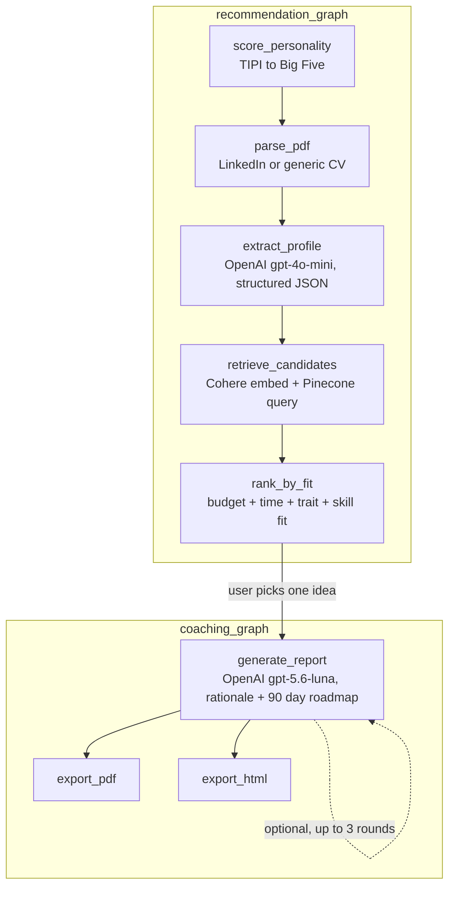

# AI Entrepreneur Coach

A trait based business idea recommender. Takes a LinkedIn PDF export (or a regular CV), a Big Five personality quiz (TIPI), a budget, and time available, then recommends small business ideas ranked by a computed "career best fit" percentage, each with a grounded rationale and a 90 day roadmap for the one the user picks. The user can also give written feedback and regenerate the report, without changing the underlying computed numbers.

This is the **Project 3** full build (4 days). The one day intro lab that came before it is preserved unchanged in `MVP/`. See `PROJECT_PLAN.md` for the full use case, tech stack justification, scope, and risk assessment, `stack_decision.md` for why LangGraph was chosen over n8n, and `gtm_future_sprints.md` for the proposed next steps toward real users.

## Tool list

| Tool | Role |
|---|---|
| OpenAI (`gpt-4o-mini`) | Structured profile extraction from the parsed PDF, strict JSON schema output, deterministic (`temperature=0`) |
| OpenAI (`gpt-5.6-luna`) | The report narrative, working style summary, per-idea rationale, and the 90 day roadmap, also strict JSON schema output. Chosen over `gpt-4o-mini` here after a side by side comparison showed noticeably more specific, better researched roadmap text, at a meaningfully higher token cost, worth it for narrative quality but not for the cheaper, more deterministic extraction step |
| Cohere (`embed-v4.0`) | Embeddings for retrieval (matching a person's profile to business ideas) and for semantic skill matching (replacing literal text matching, which does not work well for real resumes) |
| Pinecone | Vector database storing 463 business ideas derived from O*NET occupation data, queried by embedding similarity |
| LangGraph | Orchestrates the fixed step sequence as two graphs (see diagram below), see `stack_decision.md` for why this was chosen over n8n |
| Gradio | The UI |
| pypdf | Local PDF text extraction, before any LLM call |
| fpdf2 | PDF report export |

## Architecture

The pipeline is split into two LangGraph graphs, at the point where the app needs real user input (which idea to build a roadmap for), instead of one graph with an `interrupt()`.



The user's written feedback (if any) loops back into `generate_report` only, it can reshape the narrative and roadmap but never the computed `career_best_fit_percentage`, `budget_range_eur`, or `time_range_hours_per_week`, those come from `pipeline/matching.py`, not from the LLM.

## Structure

- `app.py`, Gradio UI, run this to use the app
- `pipeline/`, the pipeline logic, one module per stage:
  - `clients.py`, Cohere/Pinecone singleton clients
  - `profile_parsing.py`, PDF to sections (LinkedIn export parser, plus a generic fallback for other CV formats)
  - `profile_extraction.py`, sections to structured profile (the OpenAI call)
  - `personality.py`, TIPI questions and Big Five scoring
  - `matching.py`, retrieval and the 4 part fit calculation (budget, time, trait, skill)
  - `reporting.py`, report narrative generation and PDF/HTML export
  - `graph.py`, the two LangGraph graphs described above
  - `full_pipeline.py`, a plain non-graph entry point (`run_full_pipeline`), same steps as one function call
  - `__init__.py`, re-exports everything, so `import pipeline; pipeline.some_function(...)` works without knowing which submodule it lives in
- `ai-entrepreneur-coach.ipynb`, the O*NET dataset build (occupation selection, enrichment, Pinecone upload) and the original LangGraph prototyping, step by step with inline output
- `input/onet/`, the O*NET-derived business idea dataset (`business_ideas_enriched.json`, 463 ideas) and the O*NET source CSVs it was built from
- `input/`, sample profiles used for testing (`Profile.pdf`, a LinkedIn export, and a plain CV)
- `output/`, generated reports land here, named `report_<user_name>_<business_idea_name>.pdf` / `.html`
- `MVP/`, the one day lab build, preserved unchanged as a reference (hand curated 8-idea list, no retrieval, no LangGraph)
- `PROJECT_PLAN.md`, full project plan (use case, tech stack, scope, risks, phases)
- `stack_decision.md`, LangGraph vs n8n, required by the project brief
- `gtm_future_sprints.md`, proposed go-to-market sprints for after Project 3, required by the project brief

## Setup

Needs three keys in `.env`: `OPENAI_API_KEY`, `COHERE_API_KEY`, `PINECONE_API_KEY`, and a Pinecone index named `entrepreneur-coach-ideas` already populated (built by `ai-entrepreneur-coach.ipynb`).

```
pip install -r requirements.txt
```

## Run it

```
python app.py
```

Then open `http://127.0.0.1:7860`, upload a profile PDF (LinkedIn export or a regular CV), fill in the TIPI quiz plus budget and time available, and submit.

## Known limitations

See `PROJECT_PLAN.md` Risk Assessment for the full list. The two biggest:

- Budget and time ranges per business idea are still an AI estimate. The AI is guided by two real O*NET signals (`job_zone`, how much training the real job needs, and `typical_work_week_score`, how many hours/week people in that real job tend to work), but O*NET has no direct data on business startup cost or solo side-business time commitment, so those two numbers are a proxy, not a direct measurement.
- Skill/idea semantic matching (Cohere embeddings) has a natural "noise floor", two unrelated but both professional-sounding skill lists can still score a moderate similarity, not zero.
