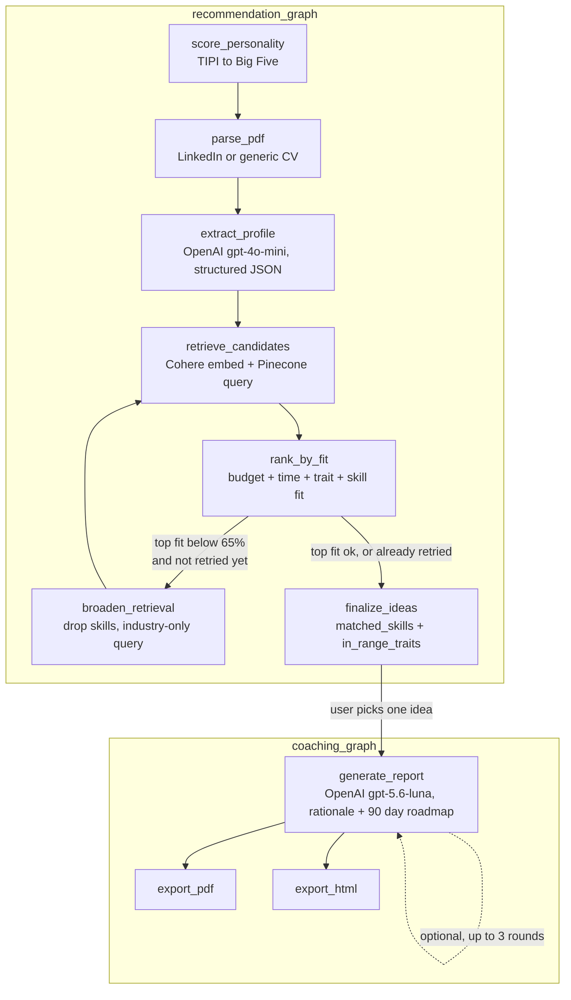

# Stack Decision: LangGraph vs n8n

**Primary stack: LangGraph**

## Why I picked LangGraph

My project has a fixed sequence of steps, not something an agent should decide on its own: parse the PDF, extract a structured profile, score the Big Five quiz, retrieve candidate business ideas from Pinecone, rank them by a fit score, then write the explanation and the 90 day roadmap. This is not a workflow that connects different business systems together, it is closer to a data pipeline written in Python, with real data moving from one step to the next (a parsed profile, a ranked list, computed fit scores).

LangGraph lets me build this as an actual typed Python graph (`StateGraph` with `TypedDict` state), and each step is its own node, so I can test and inspect it separately. This helped a lot for debugging during the build, and it also makes the pipeline easier to explain in the presentation.

A simple chain of Python functions would also run this sequence correctly, but LangGraph gives more room to grow. For example, `recommendation_graph` now has real conditional branching: after `rank_by_fit`, if the best match is below a confidence threshold, it goes to `broaden_retrieval` and tries `retrieve_candidates` again with a wider query, instead of just returning a weak match as if it was a good one. If the match is good enough, it goes straight to `finalize_ideas`. A plain function chain could only do this with nested if/else, not with a real graph edge I can inspect. There is also more I have not used yet, like checkpointing (so a crashed run could continue instead of starting over), a real `interrupt()` for human-in-the-loop (right now I split the pipeline into two separate graphs instead, one for ranking and one for the coaching report, since I need the user to pick an idea in between), and tracing/visualizing the graph for debugging.

Both graphs, split at the point the user picks an idea:

The user's written feedback (if any) loops back into `generate_report` only, it can reshape the narrative and roadmap but never the computed `career_best_fit_percentage`, `budget_range_eur`, or `time_range_hours_per_week`, those come from `pipeline/matching.py`, not from the LLM.

## Why not n8n

n8n works best when the job is to connect existing business systems together, like a CRM, a ticketing tool, Slack, or a billing platform, using pre-built connector nodes and visual branching. My project does not have systems like that to connect, everything happens inside one Python codebase: PDF parsing, OpenAI calls, Cohere embeddings, Pinecone queries, and PDF/HTML report generation. The logic here is closer to a typed data pipeline than a business process.

If I built this in n8n, I would either end up putting most of the logic inside Code nodes anyway (which means losing n8n's main advantage), or I would have to fight the visual builder to express things like the ranking math or the structured LLM output schema, which are much easier to write directly in Python. So I did not use n8n anywhere in this project, not even as a small helper, there was no trigger or webhook case that actually needed it.